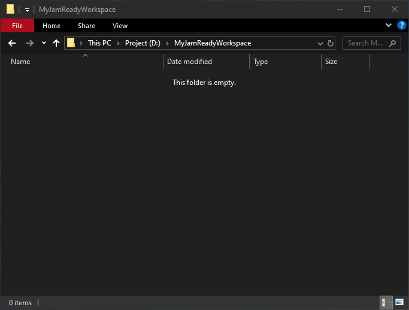
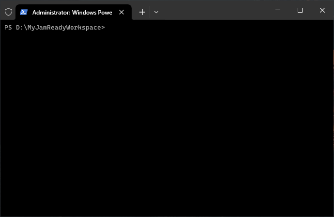
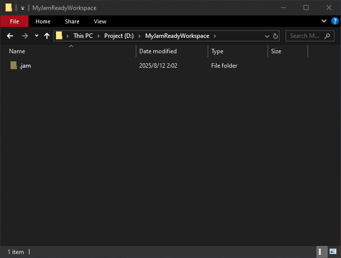

# 作为服务端管理者

> 编写时版本: Release_0.1.2

​	您将作为 服务端管理者，学习如何使用 JamReady CLI 创建工作区、管理成员、职责。

服务端仅 **存储文件** 和 处理 **客户端请求**，不具备任何文件管理的能力。

## 一、建立工作区

​	让我们开始创建第一个工作区吧！

​	第一步、打开您需要创建工作区的目录，最好是如下图一样的空目录：



​	第二步、在此目录打开您系统的终端



​	在终端键入如下命令，`jam` 会在您的目录生成工作区信息

```bash
# Setup workspace
> jam setup YourWorkspaceName
Server workspace has been established
```

​	记录工作区信息的文件是隐藏的，若您打开了您系统的 “显示隐藏文件” 选项，您将看到目录下新增了 `.jam` 目录：



​	至此，您的 `服务端工作区` 便建立完成。


## 二、创建成员，添加职责

​	`成员` 是为您项目中每一位成员准备的 `唯一身份标识`，它用于识别项目中成员的身份。

​	现在，您的项目组中有以下成员，您需要逐一为其创建身份：

| 成员名 | 职责        |
| ------ | ----------- |
| Juliet | 美术        |
| Bob    | 程序        |
| Peter  | 策划 + 队长 |

​	让我们回到命令行，键入如下命令

```bash
# Add members
> jam add member juliet
Member "juliet" has been added to the workspace, login code: RGPI-CXUM

> jam add member bob
Member "bob" has been added to the workspace, login code: M2UU-MCU5

> jam add member peter
Member "peter" has been added to the workspace, login code: DTMY-4SL1

# Add duties
> jam add duty creator juliet
Added duty "Creator" for member "juliet"

> jam add duty developer bob
Added duty "Developer" for member "bob"

> jam add duty leader peter
Added duty "Leader" for member "peter"

> jam add duty producer peter
Added duty "Producer" for member "peter"
```

​	经过如上的操作，您的工作区将会创建 Juliet、Bob、Peter 三名成员，并为其分别分配了响应的职责。

​	您可能会注意到，在创建成员的命令结尾，有显示每个成员的 `登录代码`，这是成员连接至服务器工作区的 `必要凭证`，请将其告知给对应的成员。

​	若您在操作途中因为命令行崩溃、习惯性地 clear 或其他操作丢失了登录代码，您也可以直接使用如下命令查询到该成员的登录代码：

```bash
> jam query login-code juliet
RGPI-CXUM
```


​	好的，现在的工作区成员信息如下

| 成员名称 | 登录代码  | 职责              |
| -------- | --------- | ----------------- |
| juliet   | RGPI-CXUM | Creator           |
| bob      | M2UU-MCU5 | Developer         |
| peter    | DTMY-4SL1 | Producer + Leader |

​	是不是和开始计划的一样！


## 三、启动服务端

​	一切就绪后，您现在便可启动服务端：

```bash
jam run
```

现在，JamReady 将开放您电脑的 TCP5011 端口，等待成员开始操作工作区了。


NEXT: [作为成员](./as-member_zh_cn.md)