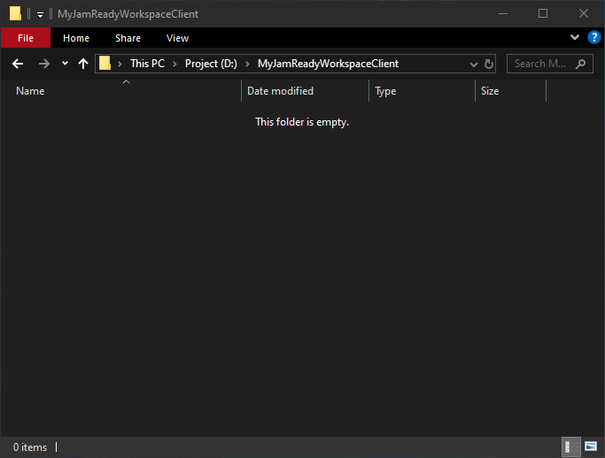
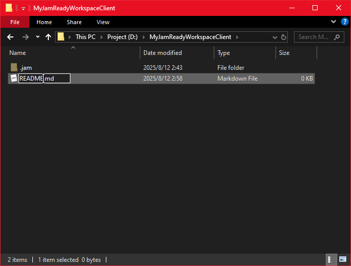
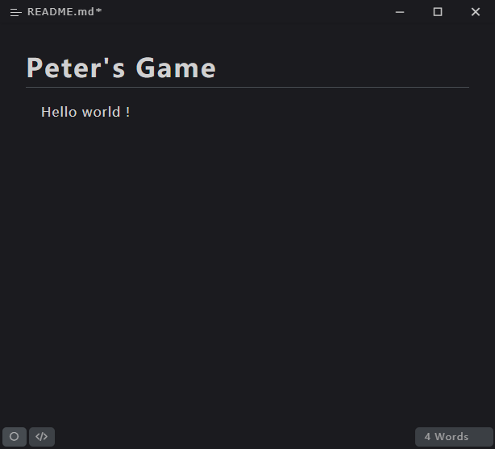
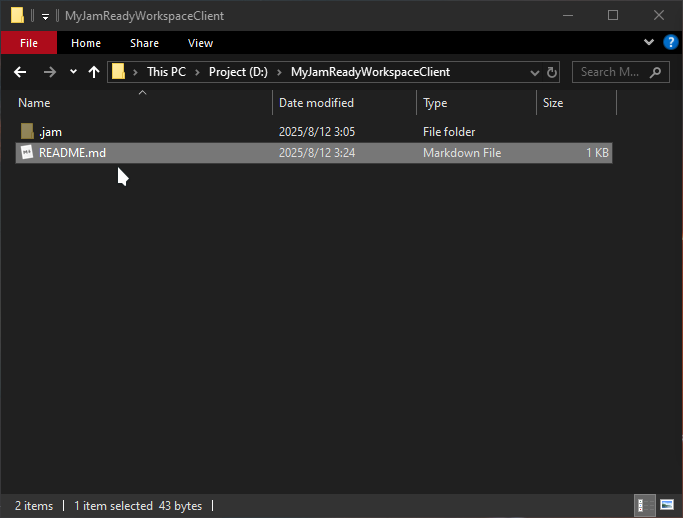
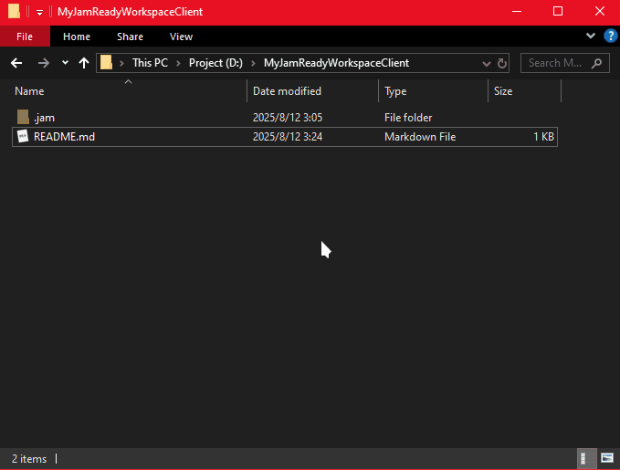

# 作为成员

> 编写时版本: Release_0.1.2

​	您将作为 项目成员，学习如何使用 JamReady CLI 的 VCS 部分，管理项目的文件。

## 一、登录至工作区

​	您现在作为 `开发者 Bob`，将要加入 `队长 Peter` 的 `服务端工作区`，一般您会入下文一般拿到您的登录代码、工作区名称。

| 队长 Peter |  Bob 你  |
| :--- | ---: |
| 嗨，Bob，服务端已经部署好了，我正在创建你的账户 |  |
|  | 好的，Peter，请将我的登录代码发我吧。 |
| 稍等 。。。 |  |
| M2UU-MCU5 👈这个是你的登录代码 |  |
|  | 工作区名称？ |
| "MyWorkspace" 👈 |  |
|  | OK ! |

​	现在，为了登录至 Peter 提供的工作区，您需要准备一个空的目录。



​	然后，在命令行键入如下命令

```bash
> jam login M2UU-MCU5 --workspace MyWorkspace
Client workspace has been established
```

​	进行如上命令后，此目录将会作为 `客户端工作区` 以 Bob 的身份指向 Peter 的 `服务端工作区`

当然 ... 如果您与 Peter 并不在同一局域网，无法使用工作区名称的方式连接，也可以使用更加直接的方法：

| 队长 Peter                                         |                                    Bob 你 |
| :------------------------------------------------- | ----------------------------------------: |
|                                                    | Peter，我连不上工作区，似乎网络发现失效了 |
| 啊？哦。。。我懂了，你这台电脑和我不在同一局域网。 |                                           |
|                                                    |              那我怎样才能连接到工作区呢？ |
| 我把服务端的地址发你吧，直接用地址连接。           |                                           |
| 我查下。。。                                       |                                           |
| peter.myworkspace.org (虚构地址，和真实无关)       |                                           |
|                                                    |                      Ok，我现在再去试试。 |

​	拿到直接的 IP 地址后，我们使用如下方式连接

```bash
> jam login M2UU-MCU5 --target peter.myworkspace.org
Client workspace has been established
```

​	至此，工作区就已经部署完成了。


## 二、创建一段介绍文档 （创建文件、获取锁定）

> ​	Peter：“Bob，我们的项目刚开始制作，我觉得需要一份 README.md 文档，用来介绍该项目。”

​	收到该通知的 Bob，现在需要开始编写他在该工作区内的第一个文件：

​	首先，在工作区目录 *新建文件 -> README.md*



​	现在，在工作区目录下，确实存在一个 `README.md` 的文件了。让我们使用命令行键入如下命令，渲染出当前工作区的结构：

```bash
> jam ls
└── README.md [Untracked]
```

​	Bob 惊讶地发现，刚刚创建的 `README.md`，居然被标记为了 `Untracked`！

这是因为该文件仅存在于本地，并未添加至工作区。

​	现在需要将该文件添加至工作区：

```bash
# Add README.md to Workspace
> jam add README.md
Ok: Created virtual file 'README.md'
```

​	添加完成后，再次渲染当前工作区的结构：

```bash
> jam ls
└── README.md [Empty]
```

​	可以发现，`Untracked` 变为了 `Empty`，这表明该文件已经存在于远程工作区，但是并没有任何的实质性的内容，这是因为文件现在还在本地，并未提交。

​	不过，不要急着提交，因为文件并没有写完。

​	因为文件已经在远程工作区创建，这表明所有成员都可以修改该文件，为了防止他人修改，现在需要为刚刚创建的文件 **上锁**。

```bash
> jam get README.md
Ok: Acquired lock on 'README.md'
```

​	经由此操作后，再次渲染工作区结构：

```bash
> jam ls
└── README.md [Empty] [held]
```

​	可以看到，虽然文件仍旧是 `Empty`，但是多了一个 `held`，这表明该文件已经被你拥有。

​	现在，可以开始编写 `README.md` 的内容了！

（JamReady CLI 会拒绝存储 0bit 的文件，一定得有内容！）



​	编写初版后，你决定将第一版先提交至远程工作区，让 Peter 审阅。

```bash
> jam save "First commit: README.md"
Found "README.md". Local: Exist, Changed: Changed, Uploading ...
  [■■■■■■■■■■■■■■■■■■■■■■■■■■■■■■■■■■■■■■■■] 35 B/35 B (100%) 00:00:00
Ok: Commited 1 files
Success:
D:/MyJamReadyWorkspaceClient/README.md
```

​	此时，再次渲染工作区结构：

```bash
> jam ls
└── README.md [v1]
```

​	你发现，刚刚的 `Empty` 变为了 `v1`，这说明文件已经被提交，获得了第一个版本号。但是，他拿到的锁消失了，这是怎么回事呢？

​	原来，你拿到的锁被称为 `短期锁`，这种锁在单次编辑文件 (移动、删除、提交等) 后，就会自动释放掉，若不想让锁自动被释放掉，需要使用 `长期锁` 。

​	因为你接下来要一直编写 `README.md`，所以需保持该文件的锁定：

```bash
> jam get README.md --longer
Ok: Acquired long-term lock on 'README.md'
```

​	渲染工作区结构：

```bash
> jam ls
└── README.md [v1] [HELD]
```

​	你发现，这和刚刚拿到 `短期锁` 显示的 `held` 有区别：README.md 后面标记的是 `HELD`，这便表明文件被 `长期锁` 锁定。

​	你现在将继续编写 `README.md` 的内容。。。。。

​	( 一段时间后 )

​	你完成了 `README.md` 的第二版内容，现在再次提交

```bash
> jam save
Found "README.md". Local: Exist, Changed: Changed, Uploading ...
  [■■■■■■■■■■■■■■■■■■■■■■■■■■■■■■■■■■■■■■■■] 43 B/43 B (100%) 00:00:00
Ok: Commited 1 files
Success:
D:/MyJamReadyWorkspaceClient/README.md

> jam ls
└── README.md [v2] [HELD]
```

​	此时，文件后的版本变为了 v2，这说明你的文件更新成功了。

### 要点

​	创建文件：

```bash
> jam add <PATH>
```

​	获取锁定：

```bash
> jam get <PATH/UUID>
```

​	创建文件并获取锁定：

```bash
> jam add <PATH> --get
# or
> jam add <PATH> -g
```

​	获取长期锁定：

``` bash
> jam get <PATH/UUID> --longer
# or
> jam get <PATH/UUID> -l
```

​	渲染目录结构：

```
> jam ls
```


## 三、移动、重命名文件

| 队长 Peter                             |                                     Bob 你 |
| -------------------------------------- | -----------------------------------------: |
| Bob，你的文件我看了，写的不错。👍       |                                            |
|                                        |                            哈哈😀，谢谢夸奖 |
| 你还在编写对吧，我看你拿着长期锁在。   |                                            |
|                                        | 是的，我还在编写游戏的机制实现需要的技术。 |
| 好的好的，你把文件移到docs文件夹吧，   |                                            |
| 顺便改名成 DEV_README.md               |                                            |
|                                        |  啊？我已经有几个文件引用 README.md 了啊 😫 |
| 没事没事，移动操作不会对本地有影响的。 |                                            |
|                                        |                                 我信你一回 |

​	你现在需要将 `README.md` 移动至 `docs/DEV_README.md`，Peter 跟你说这并不会影响到本地的引用，你姑且信了他一回。

```bash
> jam mv README.md docs/DEV_README.md
Ok: Moved 'README.md' to 'docs/DEV_README.md'
```

​	键入完命令后，你以为会产生大量的 “引用断裂”。实际呢，你的 `README.md` 还乖乖地放在了根目录



​	这是因为你所进行的 `move` 操作，仅仅是将远程工作区的 `README.md` 移动至了目标地址，这并不会影响到你的本地文件。

你输入了 jam ls，想渲染一次工作区结构查看情况

```bash
> jam ls
├── docs/
│   └── DEV_README.md [v2] -> README.md [HELD]
└── README.md [Moved] -> docs\DEV_README.md
```

​	你发现，在你编写的 `README.md` 后面，标记着一个 `Moved`，这代表着文件已经被移动，而后面的 ->，则指向其真正的地址。

也就是说，jam mv 的移动操作，实际上是不会导致本地的文件移动的，可以安全操作。

​	不过，如果直接在资源管理器内操作文件的移动，是真的会导致引用断裂的，就像这样：



如上操作后，再次渲染工作区结构：

```bash
> jam ls
└── docs/
│   ├── DEV_README.md [HELD]
│   └── README.md [Untracked]
```

​	会发现，docs 目录中，同时存在一个不存在于本地的 DEV_README.md 和一个未被追踪的 README.md

想要正确地移动本地文件，需要使用如下命令

```bash
> jam mv 'docs/DEV_README.md' 'docs/DEV_README.md' --local
Moved local file 'D:\...\README.md' to 'D:\...\DEV_README.md'
```

​	这样本地的 README.md 便也移动至了 `docs/DEV_README.md`

> ​	为什么第一个参数 <FROM> 是 `docs/DEV_README.md` 而非 `README.md` ?
>
> 因为：第一个参数是 “远程工作区的地址”，所以，此处应当填写 刚刚移动的 `docs/DEV_README.md`，CLI 会自动通过 `远程工作区地址` 找到本地文件的路径，并对其移动。

​	若需要让整个`本地工作区`的文件结构都完全和`远程工作区`对应，可以使用 jam update 命令：

``` bash
> jam ls
├── docs/
│   └── DEV_README.md [v2] -> README.md [HELD]
└── README.md [Moved] -> docs\DEV_README.md

> jam update
  [■■■■■■■■■■■■■■■■■■■■■■■■■■■■■■■■■■■■■■■■] 522 B/522 B (100%) 00:00:00
Ok: Sync database.
Ok: Move D:/MyJamReadyWorkspaceClient/README.md to D:/MyJamReadyWorkspaceClient/docs/DEV_README.md
Ok: Sync file struct.
Ok: Removed empty directories.
Ok: Done.

> jam ls
└── docs/
│   └── DEV_README.md [v2] [HELD]
```


### 要点

​	移动文件

```bash
> jam mv <FROM_PATH/UUID> <TO_PATH>
# or move local
> jam mv <FROM_PATH/UUID> <TO_LOCAL_PATH> --local # -l
```

​	同步工作区

```bash
> jam update
# or 
> jam sync
```


## 四、回滚版本

​	现在，您将作为团队中的美术 Juliet，来学习如何回滚你的版本。

| 队长 Peter                                                   | Juliet 你                                           |
| ------------------------------------------------------------ | --------------------------------------------------- |
| Juliet。。。Bob那边使用你的第三版本，发现你做的药水瓶奇大无比 |                                                     |
|                                                              | 可是文档里要求说 64x 大小，我不填满是不是不太好啊？ |
| 你还是回滚到第二版本吧，就按照原来的大小。                   |                                                     |
|                                                              | 好吧。。。。。                                      |

​	让我们看看现在正在画的图案：


​	既然要求了要回滚到版本2，那就回滚吧，在那之前，先看看工作区结构

```bash
> jam ls
├── art/
│   └── potion.png [v3] [HELD]
└── docs/
│   └── DEV_README.md [LOCKED]
```

​	你正在画的 `art/potion.png` 现在是 v3 版本，看看旧版本长啥样再回滚吧。

```bash
> jam view art/potion.png --version 2
  [■■■■■■■■■■■■■■■■■■■■■■■■■■■■■■■■■■■■■■■■] 257 B/257 B (100%) 00:00:00
Ok: File download completed
```

​	本地文件回溯到 v2 后，可以看到确实。。。。。改大了好多。


​	渲染工作区结构

```bash
> jam ls
├── art/
│   └── potion.png [v2↓] [HELD]
└── docs/
│   └── DEV_README.md [LOCKED]
```

​	可以看到，版本号显示 [v2↓]，这表明本地版本过旧，意味着本地文件的回溯已经成功了。

但是我们的目的是将 `远程工作区` 的 `art/potion.png` 回溯到 v2

​	为了让 `远程工作区` 的 `art/potion.png` 正确回溯，你键入了如下命令

```bash
> jam rollback art/potion.png 2
Ok: Rollback to '2'
```

​	此时，再次渲染工作区结构

```bash
> jam ls 
├── art/
│   └── potion.png [v2] [HELD]
└── docs/
│   └── DEV_README.md [LOCKED]
```

​	可以看到，版本已经变为了 v2，这正是我们想要的。

(又要返工了 😟)


### 要点

​	查看 / 下载 文件

```bash
> jam view <FILE_PATH/UUID>
```

​	查看 / 下载 指定版本的文件

```bash
> jam view <FILE_PATH/UUID> --version <VERSION>
# or 
> jam view <FILE_PATH/UUID> -v <VERSION>
```

​	回滚版本

```bash
> jam rollback <FILE_PATH/UUID> <VERSION>
# or
> jam rb <FILE_PATH/UUID> <VERSION>
```

